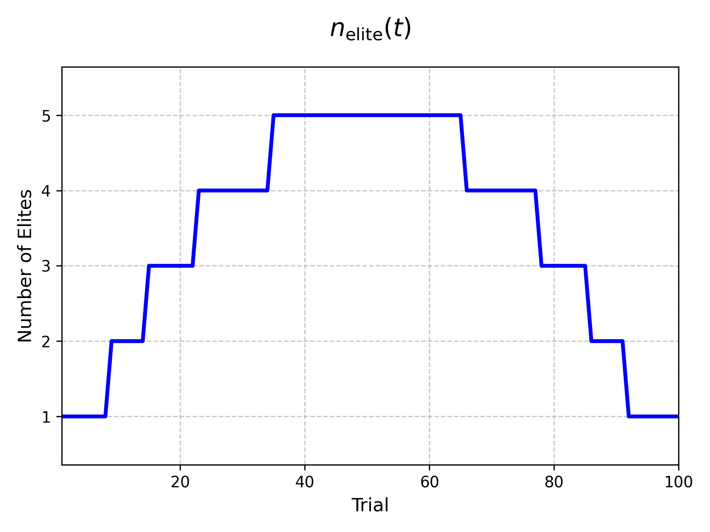
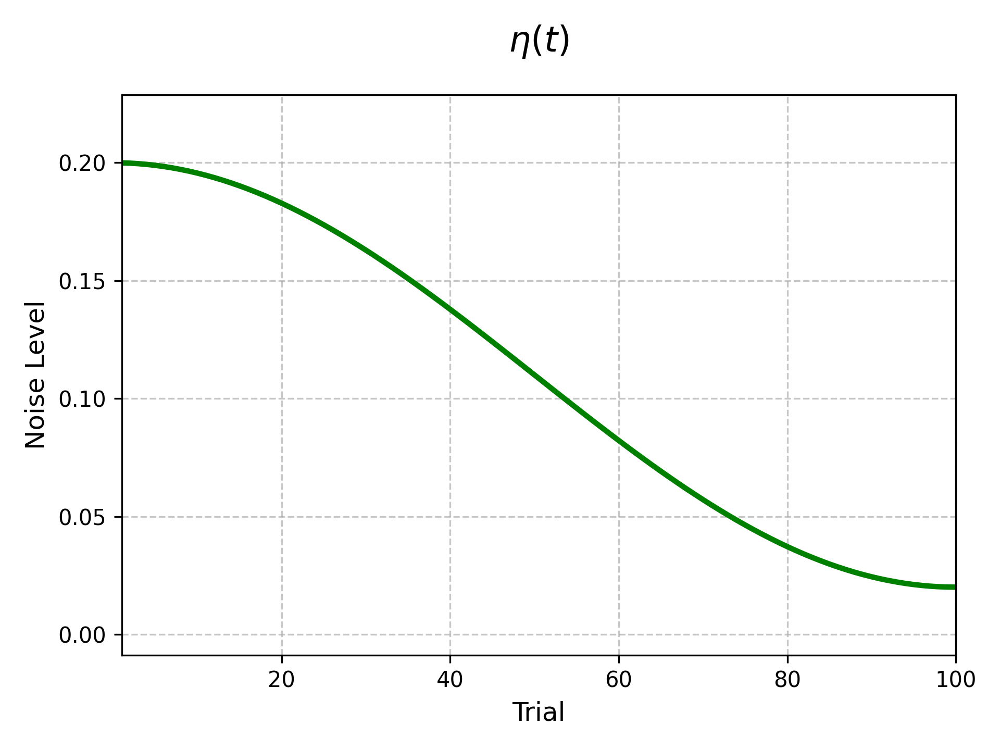
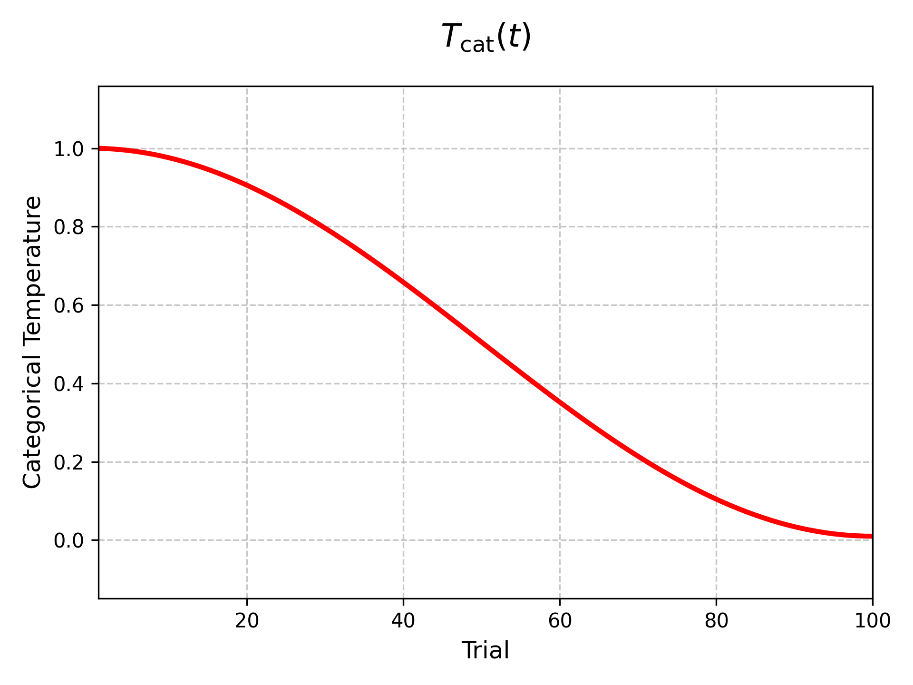

# Algorithm Overview

## 1. General Structure of the Algorithm

This method conducts an iterative search over a parameter space that may contain **continuous**, **integer**, and **categorical** variables. Its main components are:

1. **Elite Selection**  
   A set of the best-performing trials (based on the objective function) is selected at each iteration. These are the "elites."

2. **Noise Perturbation**  
   New candidate solutions are generated by perturbing the parameters of these elite trials with a noise term that adapts over time.

3. **Noise Annealing**  
   The noise level is decreased as the number of iterations increases, often using a cosine-annealing schedule. This ensures broader exploration at the beginning and more focused exploitation later on.

4. **Categorical Handling**  
   Categorical parameters are internally represented via one-hot encoding. A softmax function (with a temperature parameter) is used to stochastically choose among possible categories based on the (perturbed) mean of elite vectors.

5. **Integer Handling**  
   Integer parameters are sampled as continuous values and then probabilistically rounded to the nearest integers.

Let the key variables be defined as:

- $N$ : Total number of iterations (trials)
- $t$ : Current iteration index, where $1 \le t \le N$,  
- $p_t$ : Progress ratio, defined as $\frac{t}{N}$

---

## 2. Number of Elite Trials $n_{\text{elite}}$

At each iteration $t$, the number of elite trials selected to guide the next sample can be defined by a function that depends on the progress ratio $p_t$:

$$
n_{\text{elite}}(t) 
= 
\max \Bigl(1,\; 
\text{round} \bigl(2 \sqrt{N}\cdot p_t\cdot(1 - p_t)\bigr)
\Bigr)
$$

where:

- The factor $p_t(1 - p_t)$ creates a bell-shaped curve over $t\in[0,N]$, reaching its maximum around $t \approx \frac{N}{2}$.  
- The use of $\max(1,\dots)$ ensures that at least one trial is always considered elite.

### Visualizing $n_{\text{elite}}(t)$
If desired, a plot of $n_{\text{elite}}(t)$ against $t$ can show how the number of elite trials starts near 0 or 1 at $t=0$, grows to a maximum in the middle iterations, and then decreases again near $t=N$.

---

## 3. Noise Scheduling with Cosine Annealing

Let $\eta_{\text{init}}$ be the **initial noise** (e.g., 0.2) and $\eta_{\text{final}} = \frac{1}{N}$ be the **final noise** (or another chosen small value). At iteration $t$, define a **cosine annealing** factor:

$$
\text{cos}\_\text{anneal}(t) 
= 
0.5 \bigl(1 + \cos(\pi p_t)\bigr)
$$

Then, the noise level $\eta(t)$ can be updated as:

$$
\eta(t) 
= 
\eta_{\text{final}}
+
\bigl(\eta_{\text{init}} - \eta_{\text{final}}\bigr)\text{cos}\_\text{anneal}(t).
$$

- When $t$ is close to 0, $p_t=0$, so $\cos(\pi p_t)=1$ and $\eta(t)\approx \eta_{\text{init}}$.  
- Near $t = N$, $\cos(\pi p_t)=-1$, so $\eta(t)\approx \eta_{\text{final}}$.

Hence, the noise transitions gradually from a larger initial value down to a smaller final value.

### Visualizing $\eta(t)$
A plot of $\eta(t)$ across iterations $t$ typically shows a smooth curve descending from $\eta_{\text{init}}$ at $t=0$ to $\eta_{\text{final}}$ at $t=N$.

---

## 4. Continuous and Integer Parameters

### 4.1. Continuous Variables

For a continuous variable $x$ in the range $[\text{low},\text{high}]$, new samples may first be drawn randomly (uniformly or log-uniformly) during early iterations. Once enough iterations have passed, the algorithm exploits the elite solutions:

1. **Select an Elite Value**  
   One of the elite trials (in terms of objective value) is chosen at random. Let its parameter be $x_{\text{elite}}$.

2. **Add Noise**  
   Draw a random value $\delta \sim \mathcal{N}(0,\eta(t))$:

   $$
   x_{\text{new}} =
   x_{\text{elite}} 
   + 
   \delta \cdot (\text{high} - \text{low})
   $$

3. **Reflect at Boundaries**  
   If $x_{\text{new}}$ goes below $\text{low}$ or above $\text{high}$, it is reflected back into the valid range. For instance:

   $$
   \text{while } x_{\text{new}} < \text{low} \text{ or } x_{\text{new}} > \text{high}: 
   \quad
   \begin{cases}
   x_{\text{new}} = \text{high} - (x_{\text{new}} - \text{high})/2 &\text{if } x_{\text{new}}>\text{high},\\
   x_{\text{new}} = \text{low} + (\text{low} - x_{\text{new}})/2 &\text{if } x_{\text{new}}<\text{low}.
   \end{cases}
   $$

### 4.2. Integer Variables

To handle an integer parameter in $\{\text{low},\ldots,\text{high}\}$, one can:

1. Sample a **continuous** value as above, obtaining $v$.  
2. Let $\lfloor v \rfloor$ be the floor of $v$, and let $f = v - \lfloor v \rfloor$ be its fractional part.  
3. Draw $u$ from a uniform distribution $\text{U}(0,1)$.  
4. If $u < f$, set the integer value to $\lceil v \rceil$. Otherwise, set it to $\lfloor v \rfloor$.

Thus, a value close to 10.7 is more likely to become 11 than 10, while a value close to 10.2 is more likely to become 10 than 11.

---

## 5. Categorical Parameters: One-Hot and Softmax

When dealing with **categorical** parameters that can take one of $k$ possible values (categories), each trial's categorical choice is stored as a **one-hot vector** in $\mathbb{R}^k$. For instance, if the possible categories are ${c_1, c_2, \dots, c_k}$, then choosing category $c_1$ corresponds to the vector $[1, 0, 0, \dots, 0]$, choosing $c_2$ corresponds to $[0, 1, 0, \dots, 0]$, and so on.

---

### 5.1. Averaging and Noise (Per-Dimension)

Given a set of **elite** one-hot vectors $\{\mathbf{v}_1, \mathbf{v}_2, \dots, \mathbf{v}_{n_{\text{elite}}}\},$ we first compute their **component-wise average**:

$$
\overline{\mathbf{v}}
=
\frac{1}{n_{\text{elite}}(t)}
\sum_{i=1}^{n_{\text{elite}}(t)}
\mathbf{v}_i.
$$

This produces a real-valued vector 
$
\overline{\mathbf{v}} = [\overline{v}_1,\;\overline{v}_2,\;\dots,\;\overline{v}_k],
$
where each $\overline{v}_j \in [0,1]$. Since each $\mathbf{v}_i$ is one-hot, $\overline{v}_j$ represents the **fraction** of elite vectors that chose category $j$.

#### Adding Noise per Dimension

1. **Gaussian Noise Sample**  
   For each coordinate $j = 1,\ldots,k$, draw an independent Gaussian noise term 

   $$
   z_j \sim \mathcal{N}(0,\;\eta(t)),
   $$
   
   where $\eta(t)$ is the current noise scale.

2. **Perturb the Mean Vector**  
   Add each noise sample $z_j$ to the corresponding component $\overline{v}_j$:

   $$
   m_j = \overline{v}_j + z_j,
   $$

   producing the **noise-perturbed vector**

   $$
   \mathbf{m} = [m_1,\; m_2,\;\dots,\;m_k].
   $$

3. **Reflect Out-of-Bounds Components**  
   If a coordinate $m_j$ falls below $0$ or above $1$, **reflect** it back into the valid range $[0,1]$. For example:
   - If $m_j < 0$, set $m_j \leftarrow -m_j$. Repeat if still negative.  
   - If $m_j > 1$, set $m_j \leftarrow 2 - m_j$. Repeat if still above $1$.

This ensures that each dimension remains in $[0,1]$, even after adding noise.

---

### 5.2. Temperature and Softmax

Having obtained the noise-perturbed vector $\mathbf{m}$, we convert these $m_j$ values into a probability distribution over the $k$ categories using a **temperature-scaled softmax**.

I'll help split those equations to be on separate lines:

1. **Temperature Schedule**  
   Define a **categorical temperature** $T_{\text{cat}}(t)$ that typically **increases** over iterations (as $\eta(t)$ **decreases**). One example ties it to the same cosine-annealing schedule used for $\eta(t)$. For instance,

   $$
   \mathrm{cos\_anneal}(t) = 0.5\,(1 + \cos(\pi p_t))
   $$

   $$
   T_{\text{cat}}(t) = \eta_{\text{final}} + (1-\eta_{\text{final}})\,\mathrm{cos\_anneal}(t)
   $$

2. **Softmax Conversion**  
   Interpret each $m_j$ as a "score" for category $j$. Then compute the softmax probability

$$
\pi_j 
=
\frac{\exp(m_j \div T_{\text{cat}}(t))}
      {\sum_{r=1}^{k}\,\exp(m_r \div T_{\text{cat}}(t))},
\quad
j = 1,\dots,k.
$$

3. **Sample a Category**  
   Draw one category $j$ at random according to the probabilities ${\pi_1,\dots,\pi_k}$. The resulting **one-hot vector** is

   $$
   [\,0,\;\dots,\;1,\;\dots,\;0\,]
   \quad
   (\text{with the }j\text{-th element set to 1}).
   $$

#### Visualizing $T_{\text{cat}}(t)$
A plot of $T_{\text{cat}}(t)$ against $t$ can show how the categorical temperature starts high at $t=0$, allowing broad exploration, then gradually decreases, focusing more on the best categories over time.

## 6. Iterative Procedure

Let:

- $N$ be the total number of iterations (trials).  
- $n_{\text{init}\_\text{points}}$ be the number of initial trials that are sampled purely at random (default $\text{max(10, round}(\sqrt{N}))$ if not specified).  
- $t$ be the index of the current iteration, with $1 \le t \le N$.  
- $p_t = \frac{t}{N}$ be the **progress ratio**.

At **each iteration** $t$ (from 1 up to $N$):

**If $t \le n_{\text{init}\_\text{points}}$:**  
- **Randomly sample** all parameters (continuous, integer, and categorical) within their valid ranges.  
- Skip steps 2, 3, and 4 below (since no elite-based adaptation is used yet).

**Else**:  

1. **Compute Progress**:  

   $$
   p_t = \frac{t}{N}.
   $$

2. **Determine Elite Count**:

   $$
   n_{\text{elite}}(t) 
   =
   \max \Bigl(1,\; 
   \text{round}(2\sqrt{N}\cdot p_t(1 - p_t))\Bigr).
   $$

3. **Update Noise (Cosine Annealing)**:

   $$
   \eta(t) 
   =
   \eta_{\text{final}}
   +
   (\eta_{\text{init}} - \eta_{\text{final}}) 
   \times
   0.5(1 + \cos(\pi p_t)).
   $$

4. **Handle Parameters**:  
   - **Continuous**: Select an elite value, add $\mathcal{N}(0,\sigma)$ noise scaled by $\eta(t)$ and reflect if out of bounds.  
   - **Integer**: Same as continuous, but use *probabilistic rounding* (fractional part decides rounding up/down).  
   - **Categorical**: Form an average one-hot vector from the elites, add noise, apply a temperature-based softmax, then pick a category.

5. **Evaluate Objective**:  
   - Pass the newly sampled parameter set to the objective function for a score.

6. **Update Ranking**:  
   - Keep track of the $n_{\text{elite}}(t)$ for the next iteration.

This process repeats until $t = N$. Early in the search ($t \le n_{\text{init}\_\text{points}}$), the algorithm explores broadly by drawing random samples. Once $t > n_{\text{init}\_\text{points}}$, it transitions to the adaptive phase: higher noise in the beginning encourages wide exploration, whereas lower noise in later iterations focuses the search around the most promising solutions found so far.