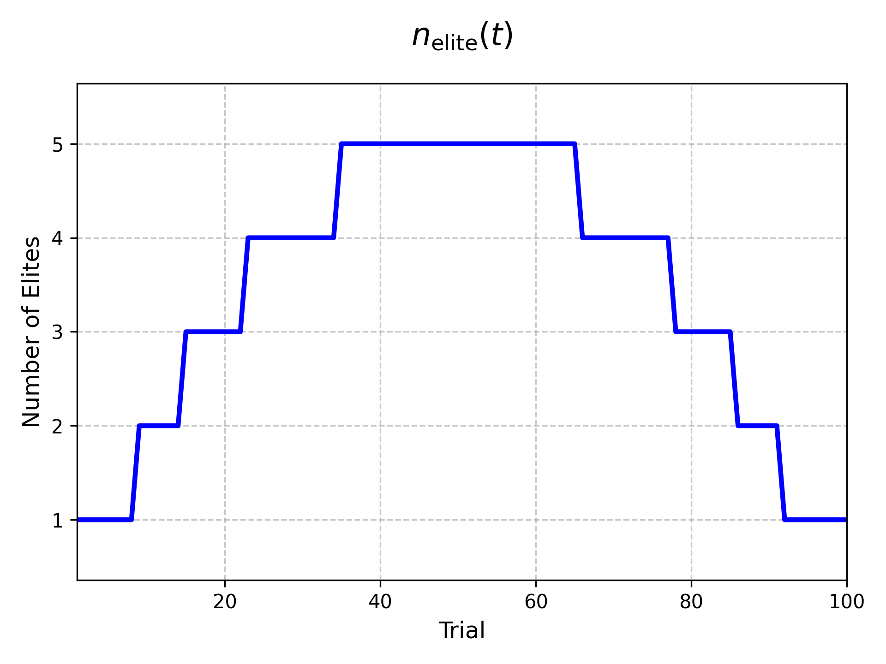
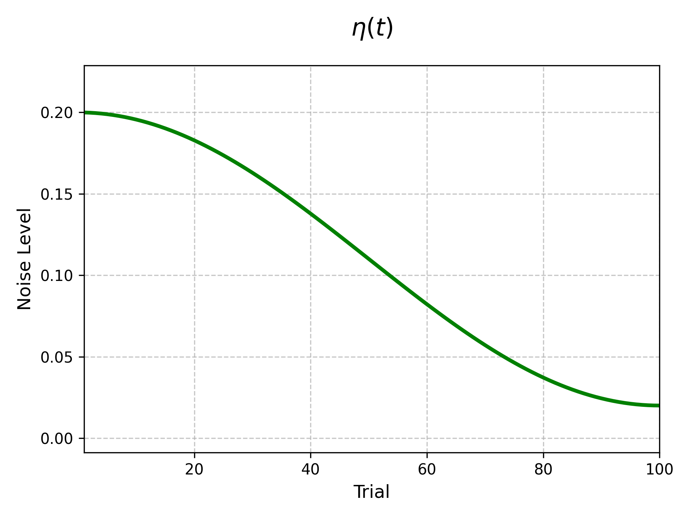
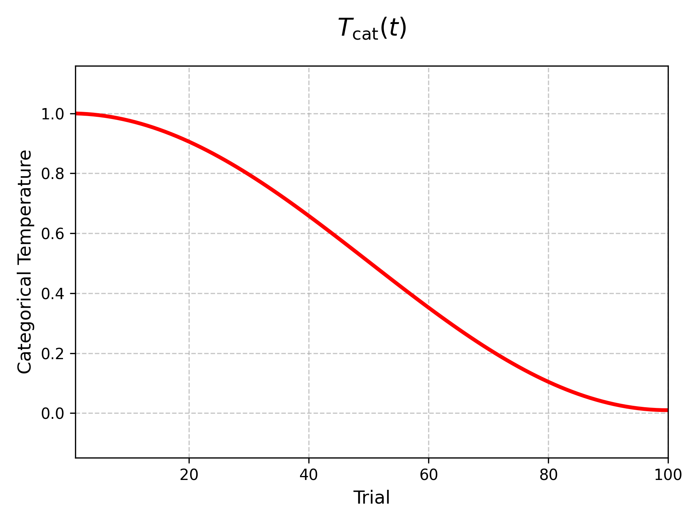

# MARS - Overview

**Mixed Adaptive Random Search** (**MARS**) is a black-box optimization method for problems of the form

$$
\min\{f(x) : x \in \mathcal{X}\},
$$

where $f$ is a real-valued objective function and $\mathcal{X}$ may contain continuous, integer, and categorical variables. Throughout the library and the documentation, we use **trial**, **solution**, and **point** interchangeably for an evaluated element of $\mathcal{X}$.

The implementation in `marsopt` should be read as an **elite-based stochastic search heuristic**: it begins with random exploration, then perturbs strong previous trials with gradually decreasing noise. The mathematical descriptions below are intended to explain the implemented behavior and its design rationale, not to claim a formal global-optimality guarantee.

## 1. General Structure of MARS

At a high level, MARS combines four ideas:

1. **Initial random exploration**  
   The first trials are sampled directly from the user-defined search space.

2. **Elite-guided sampling**  
   After enough trials have been collected, new candidates are generated around a subset of the best completed trials.

3. **Adaptive noise scheduling**  
   The perturbation scale is reduced over time so the search moves from broader exploration to more local refinement.

4. **Mixed-variable handling**  
   Continuous, integer, and categorical variables are handled within the same optimization loop using variable-type-specific sampling rules.

Let

- $N$ be the total number of trials,
- $t$ be the current trial index, with $1 \le t \le N$,
- $p_t = \frac{t}{N}$ be the progress ratio.

## 2. Elite Count Schedule

Once the adaptive phase starts, MARS uses a time-varying elite count

$$
n_{\text{elite}}(t)
=
\max \Bigl(1,\;
\text{round}\bigl(2 \sqrt{N}\, p_t(1-p_t)\bigr)\Bigr).
$$

This bell-shaped schedule is small at the beginning, largest near the middle of the budget, and small again near the end. In practical terms:

- early in the search, a very small elite set keeps the search signal sharp;
- mid-search, a larger elite set injects more diversity;
- late in the search, the elite set shrinks again so the method concentrates on refinement.

### Visualizing $n_{\text{elite}}(t)$

The corresponding plot shows that the number of elites starts near 1, rises in the middle, and then returns toward 1 near the end of the run.

## 3. Noise Scheduling with Cosine Annealing

Let $\eta_{\text{init}}$ denote the initial noise level (default $0.33$). If the user does not provide a final noise level explicitly, the implementation uses

$$
\eta_{\text{final}} = \max\!\left(10^{-7},\;\min\!\left(\frac{1}{N}, \eta_{\text{init}}\right)\right).
$$

The additional lower bound of $10^{-7}$ prevents the final noise from collapsing to zero for very large budgets, ensuring that late-stage perturbations remain numerically meaningful.

Define the cosine annealing factor

$$
\mathrm{cos\_anneal}(t)
=
0.5 \bigl(1 + \cos(\pi p_t)\bigr).
$$

Then the noise level used by MARS is

$$
\eta(t)
=
\eta_{\text{final}}
+
\bigl(\eta_{\text{init}} - \eta_{\text{final}}\bigr)\mathrm{cos\_anneal}(t).
$$

This schedule is smooth and monotone in the implemented regime: early trials use noise close to $\eta_{\text{init}}$, while later trials approach $\eta_{\text{final}}$. The qualitative role is the familiar exploration-to-exploitation transition.

### Visualizing $\eta(t)$

The noise schedule starts high and decreases smoothly over the optimization budget.

## 4. Numerical Variables

For a numerical variable with bounds $[\text{low}, \text{high}]$, MARS behaves as follows.

### 4.1. Initial Phase

During the initial random phase:

- ordinary numerical variables are sampled uniformly on $[\text{low}, \text{high}]$;
- log-scaled numerical variables are sampled uniformly in log-space.

### 4.2. Adaptive Phase

After the initial phase:

1. Select a base value from the elite set.  
   For each variable, only previously observed values that are valid for the current bounds are considered.

2. Add Gaussian perturbation.  
   For a non-log variable:

   $$
   x_{\text{new}} = x_{\text{elite}} + \delta \cdot (\text{high} - \text{low}),
   \quad
   \delta \sim \mathcal{N}(0,\eta(t)).
   $$

   For a log-scaled variable, the same idea is applied in log-space.

3. Reflect back into bounds if necessary.  
   The implementation uses a **dampened reflection**:

   $$
   \text{if } x < \text{low}, \quad x \leftarrow \text{low} + (\text{low} - x)/2,
   $$

   $$
   \text{if } x > \text{high}, \quad x \leftarrow \text{high} - (x - \text{high})/2.
   $$

   This step is repeated until the value falls in range. The important practical property is that the overshoot is reduced geometrically, so large violations are pulled back quickly without introducing a hard clip.

### 4.3. Evolution Path

MARS maintains an **evolution path** for each continuous variable. When a new global best trial is found, the displacement between the old best and the new best is recorded:

$$
\mathbf{d}_{\text{new}} = x_{\text{new\,best}} - x_{\text{old\,best}}.
$$

The evolution path is updated with exponential smoothing:

$$
\mathbf{p} \leftarrow 0.8\,\mathbf{p} + 0.2\,\mathbf{d}_{\text{new}}.
$$

During adaptive sampling, a small **drift** term is added to the perturbation:

$$
\text{drift} = 0.1 \cdot \mathbf{p} \cdot (1 - p_t),
$$

where $p_t$ is the progress ratio. This biases new proposals in the direction of recent improvement. The $(1 - p_t)$ factor fades the drift toward the end of the run so that late-stage refinement is not biased by early directional signal.

### 4.4. Small Integer Variables — Ordinal-Aware Discrete Sampler

For integer variables with a **small range** ($\le 20$ distinct values), MARS uses a dedicated ordinal-aware sampling mechanism instead of the continuous-then-round approach.

#### Initial Phase

During the initial random phase, a uniform one-hot vector of size $n_{\text{values}} = \text{high} - \text{low} + 1$ is generated and the argmax is taken, producing a uniformly random integer in $[\text{low}, \text{high}]$.

#### Adaptive Phase

1. **Build an elite histogram.**
   For each elite trial, record which integer value was chosen. This gives a count vector $\mathbf{h} \in \mathbb{R}^{n_{\text{values}}}$.

2. **Discrete Gaussian smoothing.**
   Define an annealing kernel width in step units:

   $$
   \sigma_t = 0.35 + 0.65\,(1 - p_t).
   $$

   For each bin $j$ with $h_j > 0$, a normalized Gaussian kernel centered at $j$ is computed over the full grid:

   $$
   K_j(i) = \frac{\exp\!\bigl(-\tfrac{1}{2}\bigl(\tfrac{i-j}{\sigma_t}\bigr)^2\bigr)}
   {\sum_{r=0}^{n_{\text{values}}-1} \exp\!\bigl(-\tfrac{1}{2}\bigl(\tfrac{r-j}{\sigma_t}\bigr)^2\bigr)},
   $$

   and the score vector is

   $$
   s_i = \sum_{j=0}^{n_{\text{values}}-1} h_j \, K_j(i).
   $$

   This spreads elite mass to neighboring integer values **in an ordinal-aware way**: values close to an elite value receive more mass than distant ones.

3. **Uniform floor and sampling.**
   A noise-dependent uniform floor is mixed in:

   $$
   \pi_i = (1 - \alpha)\,\frac{s_i}{\sum_r s_r} + \frac{\alpha}{n_{\text{values}}},
   \quad \alpha = \frac{\eta(t)}{n_{\text{values}}}.
   $$

   The final value is drawn from this discrete distribution.

This sampler avoids the systematic rounding bias of the continuous-then-round approach and respects the ordinal structure of integer variables (nearby values are preferred over distant ones), unlike a purely categorical treatment.

### 4.5. Large Integer Variables and Stochastic Rounding

For integer variables with **more than 20 distinct values**, the continuous perturbation mechanism from Section 4.2 is used, followed by **stochastic rounding**. If $v$ is the real-valued proposal and $\mathrm{trunc}(v)$ denotes truncation toward zero, define

$$
f = |v - \mathrm{trunc}(v)|.
$$

Then:

- with probability $f$, MARS rounds away from zero;
- with probability $1-f$, it keeps the truncated value.

This construction is useful because it keeps the expected rounded value equal to the original real-valued proposal:

$$
\mathbb{E}[\mathrm{SR}(v)] = v.
$$

So the integer mutation rule preserves the center of the underlying continuous perturbation instead of introducing a systematic rounding bias.

## 5. Categorical Variables

Categorical variables are stored internally as **integer indices**: if a categorical variable can take one of $k$ categories, each observed value is stored as an integer in $\{0, 1, \dots, k-1\}$ (with $-1$ indicating an unset value). This is more memory-efficient than the previous one-hot representation and simplifies frequency counting.

### 5.1. Elite Frequency Vector

For the categories currently available in the trial, MARS counts how often each category appears among the elite trials:

$$
f_j = \#\{i \in \text{elites} : \text{category}_i = j\}, \quad j = 1, \dots, k.
$$

The normalized frequency vector is

$$
\overline{\mathbf{f}} = \frac{1}{\sum_r f_r} \mathbf{f}.
$$

This can be interpreted as an empirical summary of how often each currently available category appeared among strong past trials.

### 5.2. Diversity-Aware Parabolic Exploration

Before the main exploit step, MARS checks whether the elite set is **dominated** by a single category. Define

$$
\text{dominance} = \frac{\max_j f_j}{\sum_r f_r},
$$

and a normalized diversity factor

$$
d = \frac{\text{dominance} - 1/k}{1 - 1/k}.
$$

The probability of taking a purely exploratory (uniform random) step is

$$
p_{\text{explore}} = \frac{d}{k} \cdot 4\,p_t(1 - p_t).
$$

The parabolic term $4\,p_t(1 - p_t)$ peaks at mid-run and vanishes at the boundaries, so:

- early on, exploration is driven by the initial random phase, not this mechanism;
- mid-run, if elites are concentrated on one category, exploration is boosted;
- late in the run, the term fades regardless of diversity.

This prevents premature categorical lock-in without wasting budget on uniform exploration when the elite distribution is already diverse or when refinement is more valuable.

### 5.3. Noise, Reflection, and Softmax Sampling

When the explore coin does not fire, MARS uses the elite frequency vector with noise and temperature-scaled softmax:

1. **Gaussian noise** is added coordinate-wise:

   $$
   \mathbf{m} = \overline{\mathbf{f}} + \mathbf{z},
   \quad
   \mathbf{z} \sim \mathcal{N}(0, \eta(t) I).
   $$

2. Each coordinate is **reflected** back into $[0,1]$ using the same dampened reflection rule as in the numerical case.

3. **Temperature-scaled softmax** converts the noisy vector to sampling probabilities:

$$
\beta_{\text{cat}}(t)
=
\frac{1}{0.1 + 0.9\,\mathrm{cos\_anneal}(t)}.
$$

$$
\pi_j
=
\frac{\exp(\beta_{\text{cat}}(t)\, m_j)}
{\sum_{r=1}^{k} \exp(\beta_{\text{cat}}(t)\, m_r)},
\quad j=1,\dots,k.
$$

Since $\beta_{\text{cat}}(t)$ increases over time, the categorical sampler becomes progressively sharper:

- early in the run, category probabilities are flatter and more exploratory;
- later in the run, the largest coordinates receive more concentrated probability mass.

If one prefers conventional temperature notation, the corresponding temperature is

$$
T_{\text{cat}}(t) = \frac{1}{\beta_{\text{cat}}(t)} = 0.1 + 0.9\,\mathrm{cos\_anneal}(t),
$$

which decreases over time. The existing plot in the documentation visualizes this reciprocal temperature scale.

## 6. Iterative Procedure

Let $n_{\text{init\_points}}$ denote the number of initial random trials. By default,

$$
n_{\text{init\_points}} = \max(10, \mathrm{round}(\sqrt{N})).
$$

At each trial:

1. If the trial index is still in the initial phase, sample every variable directly from its search space.
2. Otherwise:
   - compute the current progress ratio $p_t$,
   - compute $n_{\text{elite}}(t)$,
   - update the numerical noise schedule $\eta(t)$,
   - update the categorical sharpness schedule $\beta_{\text{cat}}(t)$,
   - sample each variable using the elite-guided rules above.
3. Evaluate the objective function on the resulting point.
4. Store the completed trial only if the objective returns a finite numerical value.

This loop continues until the requested number of trials has been completed.

## 7. Careful Theoretical Interpretation

The points below are best read as **interpretive anchors** for the implementation rather than formal equivalence statements.

### 7.1. Relation to Evolutionary Search

MARS resembles simple evolution-strategy style search in two ways:

- it keeps reusing a population of strong previous trials;
- it generates new candidates by mutating those trials with Gaussian noise.

What makes it distinctive here is the changing elite count and the explicit handling of mixed variable types. So it is reasonable to say that MARS is **in the spirit of elite-based evolutionary search**, without claiming that it is a canonical instance of a specific ES variant.

### 7.2. Role of the Elite Schedule

The term $p_t(1-p_t)$ is the variance of a Bernoulli random variable with parameter $p_t$. That observation is a useful interpretation because it peaks in the middle of the run and vanishes near the endpoints. In MARS, this gives a natural middle-heavy elite schedule:

- little averaging early, when evidence is scarce;
- more averaging in the middle, when diversity is useful;
- tighter concentration late, when refinement matters more.

This is an intuition for the schedule, not a claim that the Bernoulli model is the generative model of the algorithm.

### 7.3. Role of Cosine Annealing

The cosine schedule gives a smooth reduction in perturbation scale. Its value here is mainly practical:

- no abrupt change in search behavior,
- larger mutations at the start,
- smaller mutations near the end.

This mirrors the role of cosine schedules in other optimization contexts, such as learning-rate scheduling, but it should be understood here as a heuristic design choice for finite-budget black-box search.

### 7.4. Dampened Reflection

The dampened reflection rule can be interpreted as a stable alternative to hard clipping or full reflection:

- unlike clipping, it preserves some information about the direction and size of the overshoot;
- unlike full reflection, it shrinks the overshoot each time it crosses a boundary.

The implementation therefore behaves like a repeated contraction on the **overshoot amount**, which is enough to explain why out-of-range proposals return to the feasible interval quickly. That observation is the practically relevant point; stronger fixed-point claims are unnecessary here.

### 7.5. Evolution Path

The evolution path can be interpreted as a lightweight **cumulative step-size adaptation** mechanism, related in spirit to the path-length control used in CMA-ES. The key differences are:

- MARS tracks only the direction of improvement between successive global bests, not the full mutation distribution;
- the drift decays with progress, acting as a soft momentum that fades into pure local refinement.

This provides a directional bias when the objective has a consistent gradient-like structure, without adding significant computational overhead.

### 7.6. Ordinal-Aware Integer Sampling

The small-integer sampler can be seen as a **kernel density estimate** on a discrete grid:

- each elite value places a normalized Gaussian kernel on the integer lattice;
- the kernel width $\sigma_t$ anneals from broad (exploratory) to narrow (exploitative);
- the uniform floor prevents starvation of any integer value.

This respects the ordinal structure of integers (nearby values are more similar) while avoiding the rounding artifacts of the continuous-then-round approach. For large integer ranges, stochastic rounding remains the practical choice since the kernel approach would be unnecessarily expensive.

### 7.7. Stochastic Rounding

The most defensible theoretical property of the integer rule (used for large integer ranges) is its unbiasedness:

- deterministic rounding shifts the center of the proposal distribution;
- stochastic rounding preserves it in expectation.

That makes the integer sampler a natural extension of the numerical mutation rule rather than a separate ad hoc mechanism.

### 7.8. Categorical Sampling with Diversity-Aware Exploration

The categorical update combines two complementary mechanisms:

- **Diversity-aware exploration**: the parabolic exploration probability acts as an automatic correction for elite concentration. When elites are dominated by one category, the algorithm injects more uniform exploration mid-run. The parabolic schedule $4\,p_t(1-p_t)$ ensures this correction is strongest when it matters most and does not interfere with early random exploration or late refinement.

- **Elite frequency softmax**: the exploit branch uses elite frequencies (rather than one-hot averages) as the base signal. This is a more direct representation of categorical preference and pairs naturally with the temperature-scaled softmax. As before, Gaussian perturbation prevents rigid reuse of the modal category, and the increasing softmax sharpness gradually reduces entropy over time.

This is closely related in spirit to Boltzmann sampling and annealing-style control of randomness. The analogy is useful, but it should be read as a descriptive connection rather than as a proof that MARS inherits simulated-annealing convergence guarantees.

## 8. References

- Beyer, H.-G. and Schwefel, H.-P. (2002). Evolution strategies: A comprehensive introduction. *Natural Computing*, 1(1):3--52.
- Loshchilov, I. and Hutter, F. (2016). SGDR: Stochastic gradient descent with warm restarts. In *International Conference on Learning Representations (ICLR)*.
- Rechenberg, I. (1973). *Evolutionsstrategie: Optimierung technischer Systeme nach Prinzipien der biologischen Evolution*. Frommann-Holzboog, Stuttgart.
- Schwefel, H.-P. (1995). *Evolution and Optimum Seeking*. Wiley, New York.
