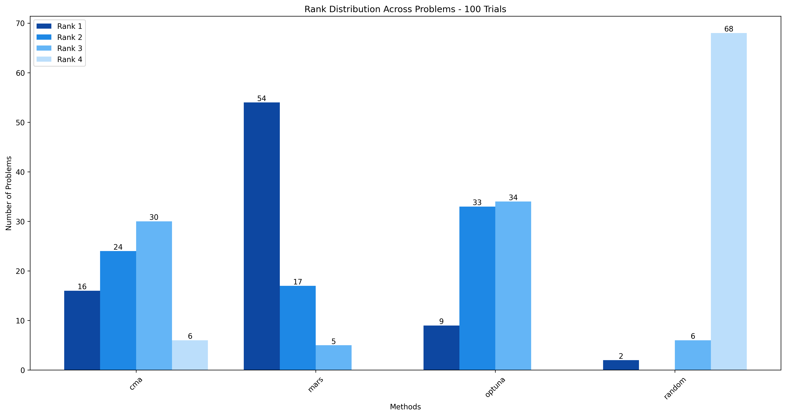
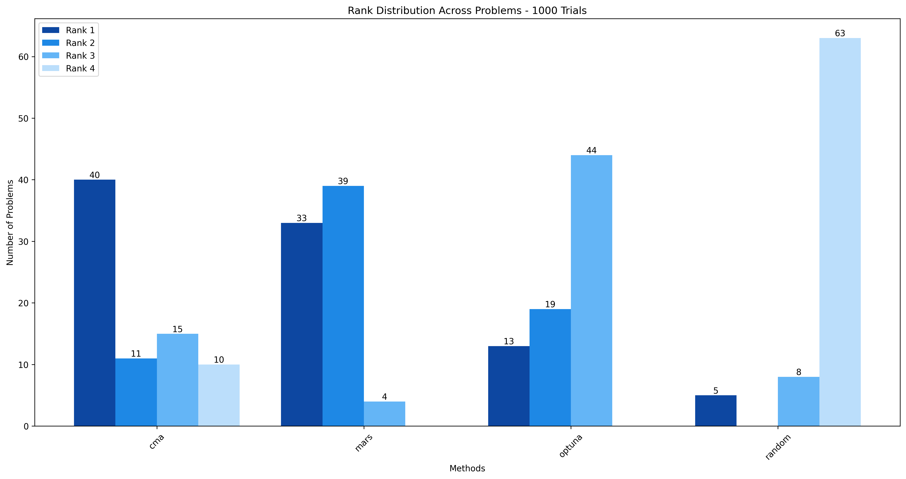
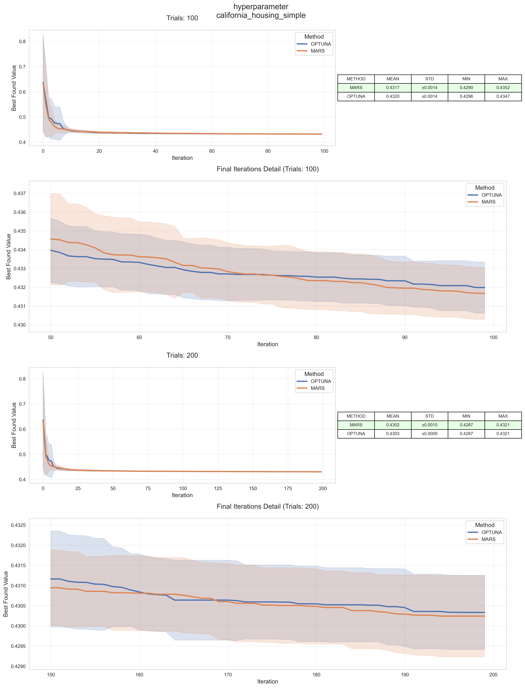
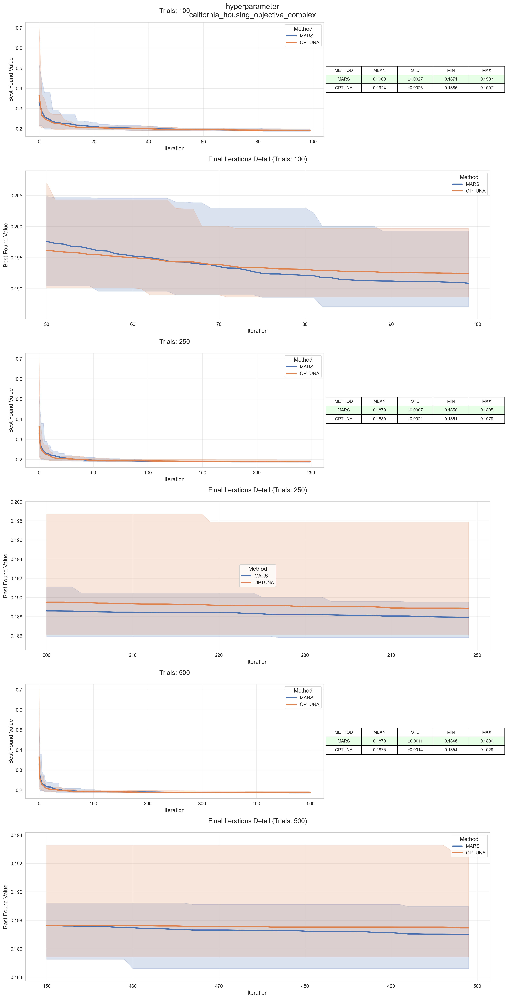

# Performance Analysis

In the subsequent part, we compare the results of `marsopt` against several well-known black-box optimization approaches.

## 1. Computation Times

We conducted 10 independent trials using a simple objective function designed to minimize the sum of 10 suggested floating-point variables. This setup ensures that the function evaluation overhead remains minimal, allowing us to focus purely on the optimization speed. We observed that MARS  demonstrates a significant performance advantage in terms of computation time over the Tree-structured Parzen Estimator (TPE) of the highly effective [Optuna](https://optuna.org/) framework. 

MARS achieves up to **150× faster performance** compared to Optuna. The results are so drastic that we had to use a **logarithmic scale on the y-axis** in the visualization (left plot).

 

## 2. Blackbox Optimization Experiments

We used [SigOpt evalset](https://github.com/sigopt/evalset/tree/main) to compile set of predefined optimization problems.  For each problem, we conducted 30 runs with different random seeds to compare the average performance of different algorithms. These algorithms are as follows:
- CMA-ES
- Optuna
- Random Search
- MARS

### Results at Different Iterations:

#### 100 Iterations

The results show that MARS significantly outperformed other algorithms when the number of trials is restricted by 100.

#### 1000 Iterations

When the number of trials was increased to 1000, CMA-ES emerged as the top performer, closely followed by MARS. It is worth noting that MARS consistently ranked in the top two positions across all problems.

## 3. LightGBM Hyperparameter Optimization

We compared two different objective functions for hyperparameter optimization using LightGBM on the California Housing dataset.

#### Simple Objective
* Uses only GBDT (Gradient Boosting Decision Tree) as the boosting type
* Has a narrower parameter search space
* Optimizes basic parameters such as:
  - L1/L2 regularization
  - Learning rate
  - Number of leaves
  - Feature and bagging fractions
  - Minimum child samples

#### Complex Objective
* Allows selection between GBDT and GOSS (Gradient-based One-Side Sampling) boosting types
* Features a wider parameter search space
* Includes additional parameters such as:
  - Top rate and other rate (for GOSS)
  - Maximum depth
  - Maximum bin
  - Additional tuning options for both boosting types

## Notice

Only a small subset of the experiments is shared on this page, for detailed plots, results, and the test scripts please visit our [OneDrive](https://1drv.ms/f/c/0b26aa4e19835550/ElBVgxlOqiYggAtXDQAAAAAB8TN-exp7i2CSE8ur4IOgYw?e=YGRRCI) folder.
